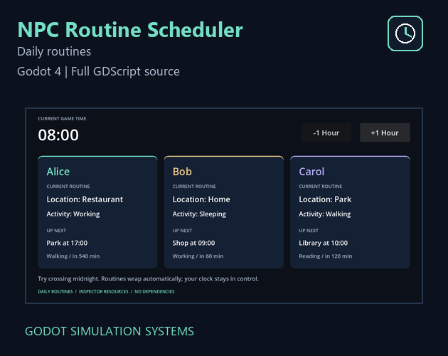
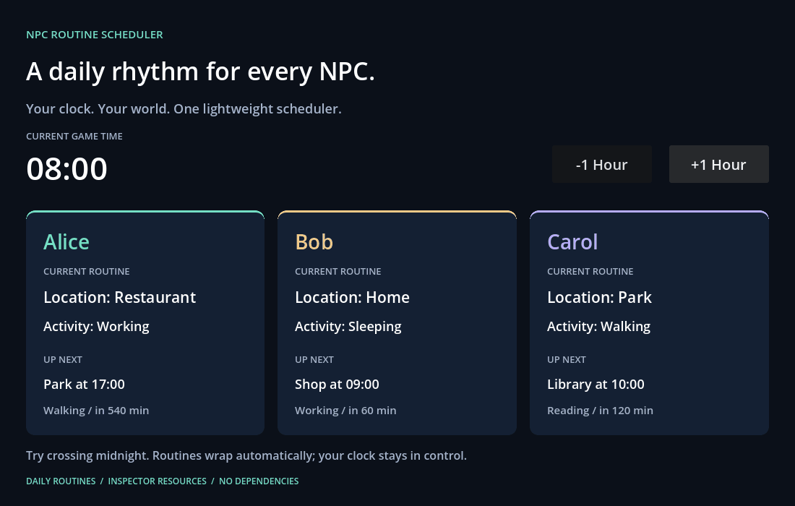
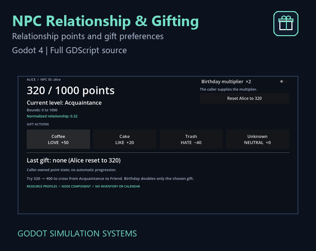
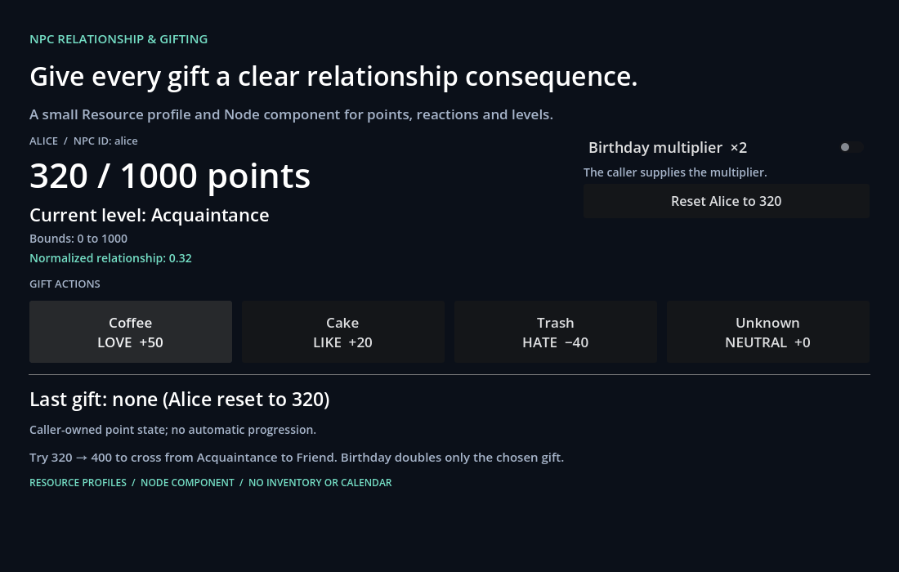
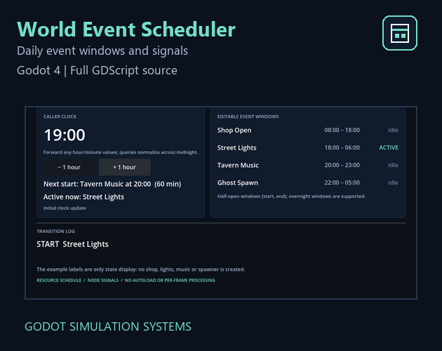
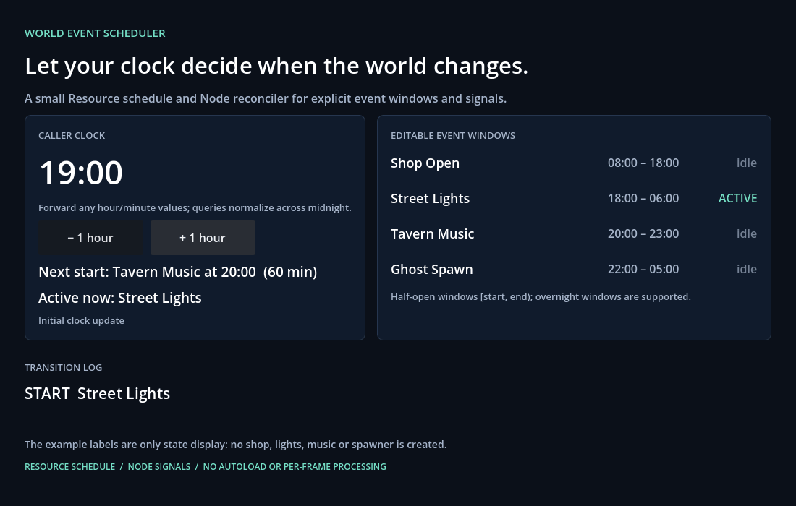
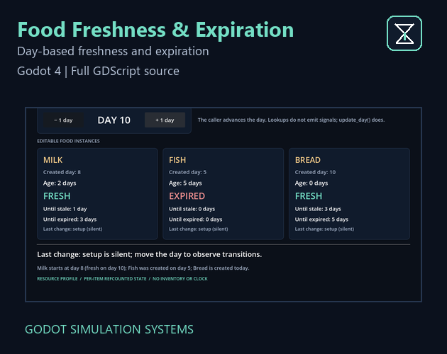
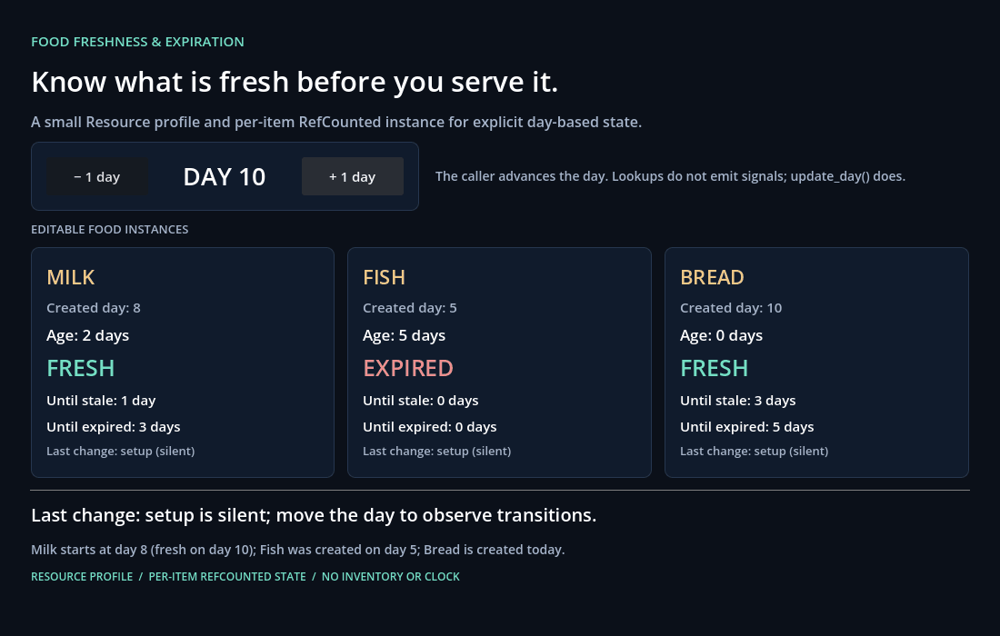
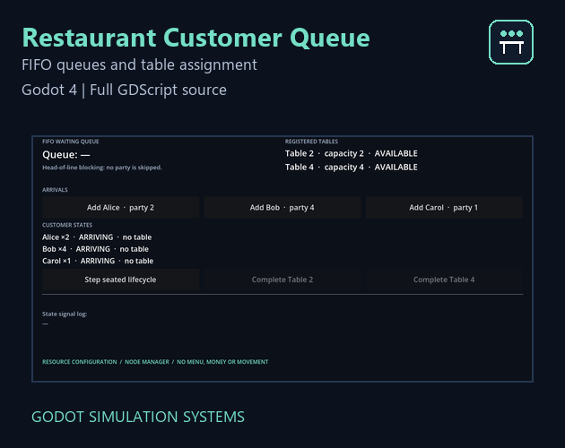
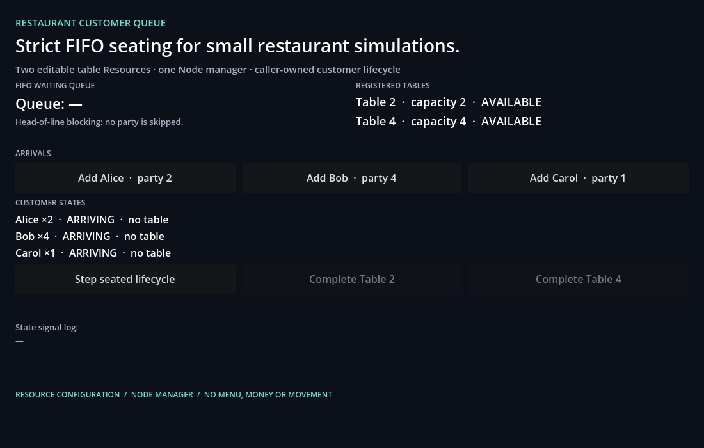

# Godot Simulation Systems

Lightweight gameplay systems for Godot 4.

Built for **Cozy Games, Life Sims, Farming Games, RPGs and Restaurant Simulations**. Each product solves one focused problem, works independently, and includes full GDScript source in the paid download.

| Product | Price (USD) | Store |
|---|---:|---|
| NPC Routine Scheduler | $4.99 | [itch.io](https://grgy078033.itch.io/npc-routine-scheduler) |
| NPC Relationship & Gifting System | $5.99 | [itch.io](https://grgy078033.itch.io/npc-relationship-gifting) |
| World Event Scheduler | $4.99 | [itch.io](https://grgy078033.itch.io/world-event-scheduler) |
| Food Freshness & Expiration System | $3.99 | [itch.io](https://grgy078033.itch.io/food-freshness) |
| Restaurant Customer Queue System | $7.99 | [itch.io](https://grgy078033.itch.io/restaurant-customer-queue) |

No bundles are offered here yet. Products are sold separately.

## NPC Routine Scheduler

Resolve daily NPC locations and activities from your own game clock.

Watch the demo

**[Get it on itch.io — $4.99](https://grgy078033.itch.io/npc-routine-scheduler)**

## NPC Relationship & Gifting System

Give NPCs relationship points, gift preferences and configurable levels.

Watch the demo

**[Get it on itch.io — $5.99](https://grgy078033.itch.io/npc-relationship-gifting)**

## World Event Scheduler

Resolve daily world events and start/end signals, including overnight windows.

Watch the demo

**[Get it on itch.io — $4.99](https://grgy078033.itch.io/world-event-scheduler)**

## Food Freshness & Expiration System

Calculate fresh, stale and expired states from item age in game days.

Watch the demo

**[Get it on itch.io — $3.99](https://grgy078033.itch.io/food-freshness)**

## Restaurant Customer Queue System

Manage FIFO customer queues, suitable tables and caller-controlled customer states.

Watch the demo

**[Get it on itch.io — $7.99](https://grgy078033.itch.io/restaurant-customer-queue)**

## Practical guides

- **[Daily NPC routines without tying them to movement](guides/daily-npc-routines.md)** — handle transitions, midnight wrap and next-entry queries; includes a real demo GIF and a captioned 30-second MP4 download.

## Compatibility

Tested with **Godot 4.7.2 stable on Windows**, using the Compatibility renderer. Typed GDScript, Inspector-friendly Resources, no required Autoload or third-party runtime dependencies. Other versions/platforms are not certified.

Compatible with other plugins in the Godot Simulation Systems collection. No plugin is required to use another.

## About this repository

This is a product landing page, not the paid source distribution. It contains product summaries, educational guides and promotional media. Each paid download includes its own runnable demo, editable Resources, documentation and commercial asset license. No addon source or release ZIP is published here.

Original media and text remain copyright their respective author(s); no open-source license for the paid addons is granted by this repository. For product questions, use the corresponding itch.io page.
